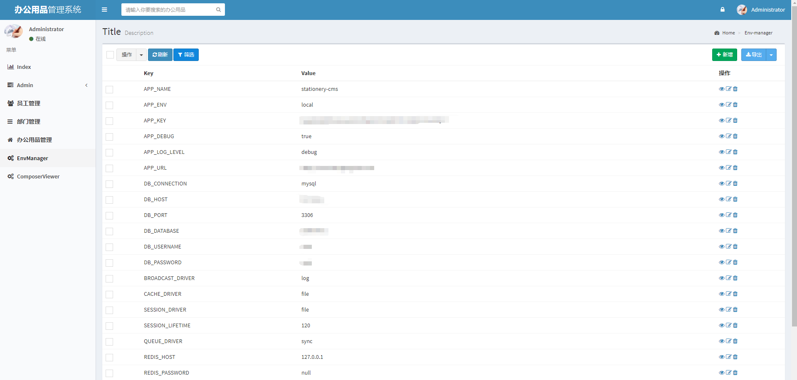
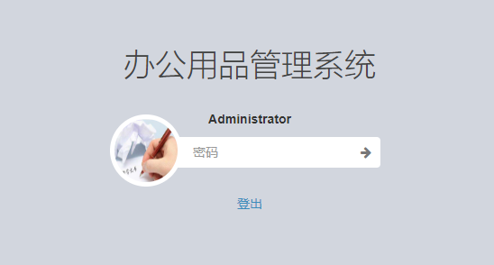
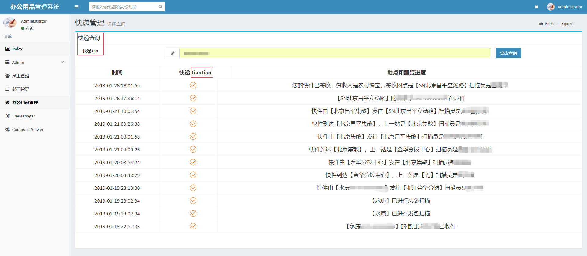
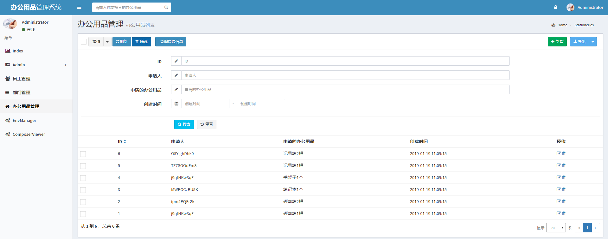
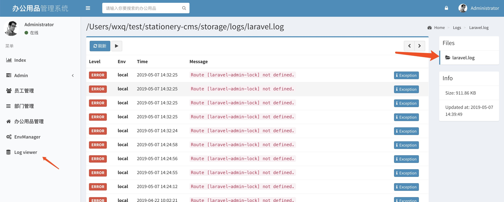

<h2 align="center">
 stationery-cms 
</h2>
<p align="center">
基于laravel-admin开发的办公用品管理系统，适用于中小型企业，项目内有查询快递功能，方便用户知道购买的办公用品的具体信息。新增导出excel功能方便公司对数据进行管理
</p>


[](https://github.com/WXiangQian/stationery-cms/issues)
[](https://github.com/WXiangQian/stationery-cms/stargazers/)
[](https://github.com/WXiangQian/stationery-cms/network/members/)
[](https://packagist.org/packages/laravel/framework)


```
本项目可以直接用，也可以用于二次开发，二次开发具体看相关文档
laravel版本为5.5.*、laravel-admin版本为1.6.*
```
[laravel-admin文档地址](https://laravel-admin.org/docs/zh)

### 克隆仓库
```
git clone git@github.com:WXiangQian/stationery-cms.git
```

### 运行环境
```
"php": ">=7.0.0"
```

### 生成配置文件
```
cp .env.example .env
```
你可以根据情况修改 .env 文件里的内容，如数据库连接、缓存、邮件设置等。

### 生成秘钥
```
php artisan key:generate
```

### 配置好.env以后执行以下命令进行创建数据库
(提示directory already exists 可忽略)

```
php artisan admin:install
```

### 如需测试数据，则执行以下命令填充数据库数据

```
php artisan db:seed
```

### 生成网站链接
```
php artisan serve

Laravel development server started: <http://127.0.0.1:8000>
http://127.0.0.1:8000为该网站的临时地址
```

### 后台

描述 | 详情
--- |---
后台登录地址 | http://127.0.0.1:8000/admin/auth/login
账号 | admin
密码 | admin
菜单管理地址 | http://127.0.0.1:8000/admin/auth/menu
员工管理路径 | users
部门管理路径 | departments
办公用品管理路径 | stationeries
env变量管理路径 | EnvManager

```
进入菜单管理地址，新增板块可方便进入，路径上述已给出
也可执行命令来添加菜单地址
php artisan add_admin_menu_data

php artisan admin:import log-viewer
添加日志查看，切记只执行一次
```
### 头像问题
```
在.env中配置APP_URL=
配置好属于自己的域名，然后修改头像就可以看到真实路径了
```
**==================================后台截图==================================**












#### 如何贡献
所有合理的改动、优化、修正，新的组件，或者文档的修正、更新 相关的提交都会被接收
